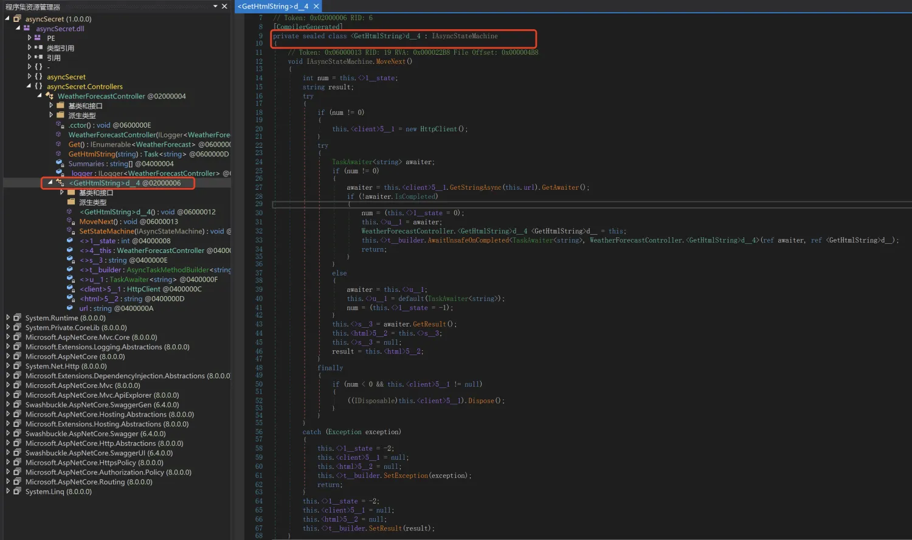

# 异步编程
现在不管前端还是后端都采用了async/await的方式来简化异步编程，.Net也如此，其实在 Framework 时期，微软就引入了异步编程，但是由于很多类都不支持异步调用，所以一直没有流行起来，直到Framework 4.5很多类开始支持异步，C#也引入了async/await，这才让异步编程成为.Net Core的主流用法。

在.Net中，使用异步方法一般如下代码所示：

```C#
//定义方法
async Task<T> MethodName1Async(){}
async Task MethodName2Async(){}

//调用方法
await MethodName1Async();
await MethodName2Async();
```

结尾的 Async 是一个约定，只是为了标识异步方法，用 `async` 关键字定义方法，用 `await` 等待方法执行，但是 `async` 并不是必须的，使用 `async` 最主要的目的是在方法内部使用 `await` 关键字，只要方法返回的是 `Task<T>` 或者 `Task` 我们就能用 `await` 来等待执行，通过使用 `async` 和 `await` 关键字使异步编程像同步一样方便。

前面已经提到了，使用 `async` 最主要的目的是在方法内部使用 `await` 关键字，这样来看，异步方法是具有传染性的，因为你要在一个方法里面`await`一个方法调用就必须把这个方法使用`async`修饰。

## async/await原理
编译器会把 async 方法编译为类，并且把异步方法中的代码分成多次方法调用。
如以下代码：
```C#
public async Task<String> GetHtmlString(string url)
{
    using HttpClient client = new();
    string html = await client.GetStringAsync(url);
    return html;
}
```
使用 dnSpy 反编译，并取消勾选：调试->设置->反编译器->反编译异步方法，能看到生成了类`<GetHtmlString>d_4`，并且实现了`IAsyncStateMachine`接口（很明显是一个状态机）


有一个重要的方法`MoveNext`，并且通过`state`记录当前执行到哪个状态，当状态改变的时候再去执行`MoveNext`，状态的改变可以认为是被`await`划分出来的。

同步要等待代码执行，异步也要等待代码执行，那为什么还要异步呢，其实async背后涉及到线程切换，在对异步方法进行await调用的等待期间，框架会把当前的线程返回给线程池，等异步方法调用结束后，框架会从线程池中再取出来一个空闲线程用来执行后序代码，需要知道的是很有可能两个线程极有可能不是同一个。

这也是为什么async被切换为状态机调用的原因，可以完美利用线程切换，利用空闲线程，从而提供服务器处理能力。

## 多线程&异步
首先要知道异步虽然存在线程切换，并有可能通过线程切换使用了不同的线程，但本质他并没有使用多线程，要把代码放在一个新的线程执行可以使用`Task.Run`方法，或者使用`Task.Factory.StartNew`方法，其实Task.Run内部是调用`Task.Factory.StartNew`来实现的。

## 性能小妙招
前面提到，使用`async`标记的方法会生成类，这样会增大程序体积，甚至有可能会拖慢系统响应能力，所以如果程序只是简单的返回`Task`，而不是需要等待任务完成，可以不使用`async`去修饰方法，直至最终需要`await`调用的那个方法才使用`async`修饰方法，我称为延迟使用。

## 不是什么好办法
如果不方便使用`await`，当返回值是`Task<T>`时，可以使用`.Result()`、`.GetAwaiter().GetResult()`来等待，如果返回`Task`，可以使用`.Wait()`来等待，但这些都不是什么好方法，因为有可能会造成死锁，最好还是使用`async/await`。